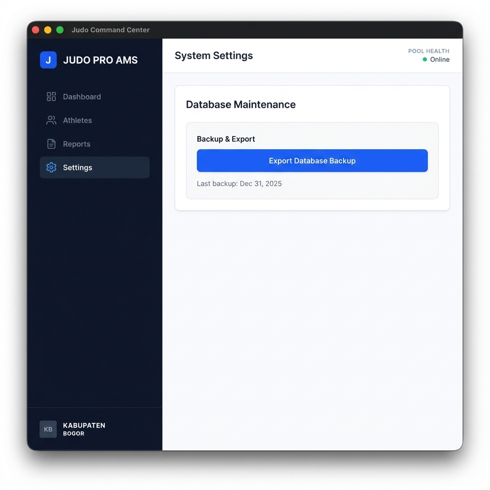

# Tech-Spec: Database Backup & Snapshot (Story 1.5)

**Created:** 2025-12-31
**Status:** Implementation Complete

## Overview

### Problem Statement
Users (Coaches) need a way to manually backup their data to a secure location (e.g., USB drive) to prevent data loss and ensure portability. Currently, there is no mechanism to export the underlying SQLite database file.

### Solution
Implement a "Database Backup" feature in a new "Settings" area. When triggered, the system will open a native file save dialog, allowing the user to select a destination. The system will then safely copy the current SQLite database file to that location, appending a timestamp to the filename if necessary or as per user selection.

### Scope (In/Out)
**In:**
-   creation of a basic Settings/Admin page in the UI.
-   Main process IPC handler to trigger file save dialog and perform file copy.
-   Exposing the backup functionality via context bridge.
-   UI button to trigger the backup.
-   Success/Error notification.
-   **Restore functionality**: Import database capability with overwrite warning.

**Out:**
-   Automatic scheduled backups.
-   Cloud sync.

## Context for Development

### Codebase Patterns
-   **Main Process**: `src/main/db.ts` initializes the database. We can access the db path via `app.getPath('userData')`.
-   **IPC**: `src/main/preload.ts` exposes `api` object. We should add a `system` namespace.
-   **Renderer**: `src/renderer` uses React + Tailwind. We will need a new route or view for Settings.
-   **Architecture**: Follows the pattern of `ipcRenderer.invoke` -> Main/Controller -> Service/Repository (though for file copy, a simple Service or directly in handler is acceptable if simple).

### Files to Reference
-   `src/main/db.ts`: To confirm DB file name and location logic.
-   `src/main/preload.ts`: To add new IPC definitions.
-   `src/main/main.ts`: To register the IPC handler.
-   `src/renderer/renderer.tsx` & `src/renderer/App.tsx` (if exists): To add navigation to Settings.

### Technical Decisions
-   **Backup Logic**: Use `fs.copyFile`. Since SQLite uses WAL, generally it's safe to copy while open if using the backup API, but simple file copy might result in a "hot" journal.
    -   *Refinement*: SQLite has an online backup API. `better-sqlite3` supports `.backup()`. We should use `db.backup(destination)` ensuring data integrity.
    -   *Decision*: Use `better-sqlite3`'s native `backup()` method for reliability.
-   **Settings UI**: A simple page accessible from the Sidebar.

## Implementation Plan

### Tasks

- [x] **Task 1: Implement Main Process Backup Handler**
    -   Create `src/main/services/BackupService.ts` (or similar) to handle `db.backup()`.
    -   In `main.ts` (or a dedicated IPC setup file), handle `system:backupDatabase`.
    -   Use `dialog.showSaveDialog` to get destination.
    -   Execute backup.

- [x] **Task 2: Expose IPC in Preload**
    -   Update `src/shared/types/electron.ts` (implied) to define the interface.
    -   Update `src/main/preload.ts` to expose `api.system.backupDatabase()`.

- [x] **Task 3: Create Settings Page**
    -   Create `src/renderer/features/settings/SettingsPage.tsx`.
    -   Add route/navigation item to `Sidebar` (or temp button if Sidebar refactor is needed).

- [x] **Task 4: Implement Backup Button & Feedback**
    -   Add "Export Database" button.
    -   Handle click: call API, show loading state, show success/error toast/alert.

### Acceptance Criteria

- [ ] **AC 1:** Clicking "Export Database" opens a system file save dialog.
- [ ] **AC 2:** The default filename in the dialog includes the current date (e.g., `judo_manager_backup_2025-12-31.db`).
- [ ] **AC 3:** Upon selection, the current database state is saved to the target file.
- [ ] **AC 4:** Attempting to backup while write operations are happening should wait or handle gracefully (handled by WAL/backup API).
- [ ] **AC 5:** User receives visual confirmation of success or failure.

## Additional Context

### Dependencies
-   `better-sqlite3` documentation for `.backup()`.
-   `electron` dialog module.

### Testing Strategy
-   **Manual**: Run app, add data, backup, inspect backup file (maybe try to open it with sqlite browser).
-   **Automated**: Unit test for `BackupService` if possible (mocking db).

### Notes
-   Future: Add "Restore" functionality which is more complex (requires closing DB connections).

## Review Notes
- Adversarial review completed
- Findings: 10 total, 5 fixed, 5 skipped (scope/architectural)
- Findings: 10 total, 5 fixed, 5 skipped (scope/architectural)
- Resolution approach: auto-fix
- **Update (User Request):** Added "Import Database" capability (Restore) which replaces the current database with a selected backup file.
