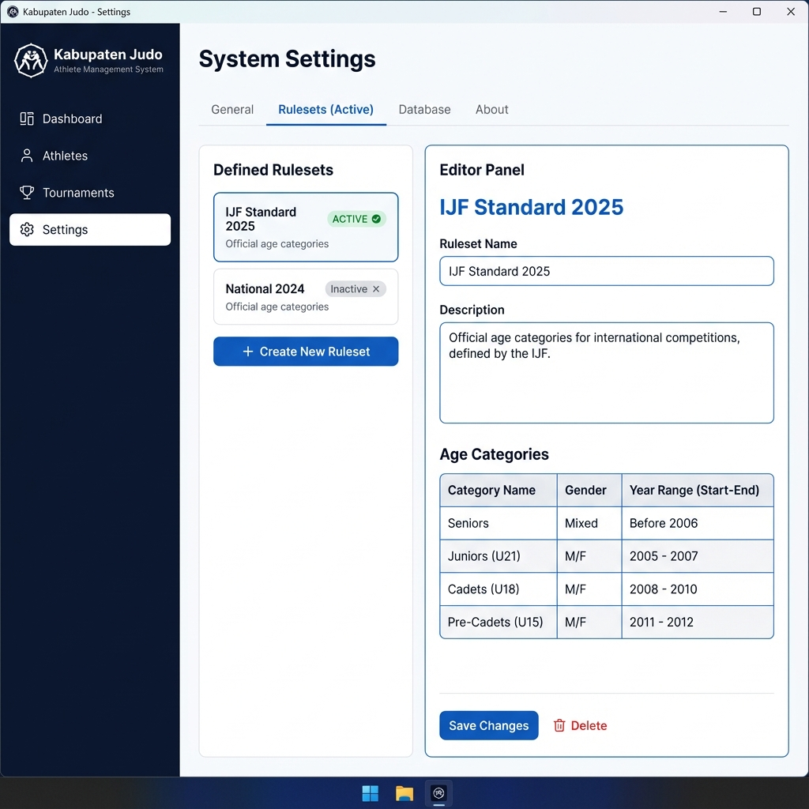

# Tech-Spec: Story 3.1 - Ruleset Definition UI

**Created:** 2025-12-31
**Status:** Implementation Complete

## Overview

### Problem Statement
Judo competitions obey specific age categories (e.g., U18, Seniors) which change over time or vary by federation. Currently, the system has no way to define these rules, making it impossible to automatically classify athletes or validate tournament eligibility.

### Solution
Implement a "Rulesets" management interface within the Settings page. This will allow users (coaches/admins) to define versioned rulesets (e.g., "IJF 2025") containing specific age categories with defined birth year ranges.

### Scope (In/Out)
**In:**
- Database schema for `Rulesets` and `AgeCategories`.
- Settings UI to list, create, edit, and delete rulesets.
- "Active" ruleset toggle.
- Preloaded "IJF Standard" ruleset.
- IPC methods for CRUD operations.

**Out:**
- Automatic athlete classification (handled in Story 3.2).
- Weight category definition (future story, focus here is Age).
- Online syncing of rulesets (local only for now).

## Context for Development

### Codebase Patterns
- **Architecture:** Electron + React + SQLite (better-sqlite3) + Zustand.
- **Styling:** Tailwind CSS with "Midnight Hybrid" theme.
- **Data Access:** Repository pattern (`src/main/repositories`).
- **IPC:** Typed `window.api` calls via `preload.ts` and `src/shared/interfaces.ts`.

### Files to Reference
- `src/main/schema.sql` (Schema definitions)
- `src/shared/interfaces.ts` (API definitions)
- `src/renderer/src/layouts/SettingsLayout.tsx` (Target UI location)

### Technical Decisions
1.  **Versioning:** Rulesets will have an `is_active` flag. Only one can be active at a time to drive system-wide logic.
2.  **Date Logic:** We will store explicit `start_year` and `end_year` for each category (e.g., U18 for 2025 might be "born 2008-2010"). This is more robust for historical data than relative ages.
3.  **Seed Data:** `002_ruleset_schema.ts` migration will insert the default IJF ruleset if the table is empty.

## Implementation Plan

### Database Schema
**New Tables:**
- `rulesets`: `id` (INT PK), `name` (TEXT), `description` (TEXT), `is_active` (BOOLEAN DEFAULT 0), `created_at` (TEXT), `updated_at` (TEXT).
- `age_categories`: `id` (INT PK), `ruleset_id` (INT FK), `name` (TEXT), `min_year` (TEXT/INT), `max_year` (TEXT/INT), `gender` (TEXT 'M'|'F'|'MIXED').

*Note: Year fields can be integers. SQLite uses dynamic typing but INT is standard.*

### Tasks

- [x] **Migration**: Create `src/main/migrations/002_rulesets.ts`:
    - Create tables.
    - Seed "IJF Standard" ruleset.
- [x] **Shared Types**: Update `src/shared/schemas.ts` with `Ruleset` and `AgeCategory` models.
- [x] **Backend**: Create `RulesetRepository`.
    - `getAll()`, `getById(id)`, `create(data)`, `update(id, data)`, `delete(id)`, `setActive(id)`.
- [x] **IPC**: Expose `rulesets:getAll`, `rulesets:save`, `rulesets:setActive` in `main.ts` & `preload.ts`.
- [x] **Frontend Store**: Create `useRulesetStore` (Zustand) to manage state.
- [x] **UI - List**: Create `src/renderer/features/settings/RulesetList.tsx`.
- [x] **UI - Editor**: Create `src/renderer/features/settings/RulesetEditor.tsx`.
- [x] **Integration**: Add "Rulesets" tab to `SettingsLayout` (inserted in SettingsPage).

### UI Design

### Acceptance Criteria

- [x] **Default Data**: App starts with "IJF Standard" ruleset present and active.
- [x] **CRUD**: User can create a new ruleset "My Club 2025" and save it.
- [x] **Categories**: User can define "U11" (2014-2015) within that ruleset.
- [x] **Activation**: Switching "Active" ruleset updates the indicator.
- [x] **Persistence**: Data survives app restart.

## Additional Context

### Dependencies
- None specific. Standard React/Tailwind.

### Notes
- "Standard IJF" data should be rough estimates or current year's actual regulation to be useful immediately.
